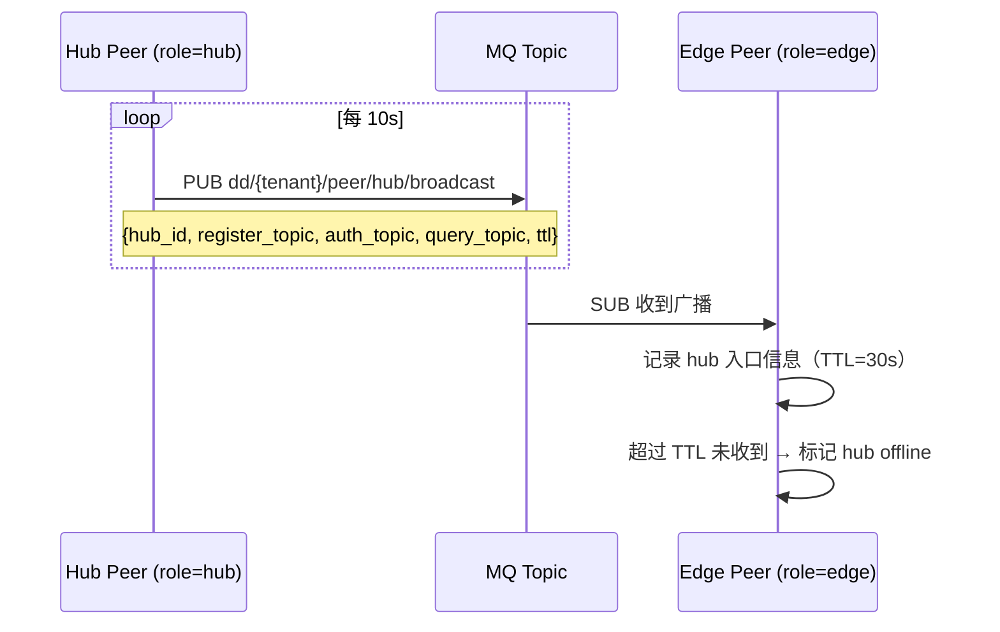
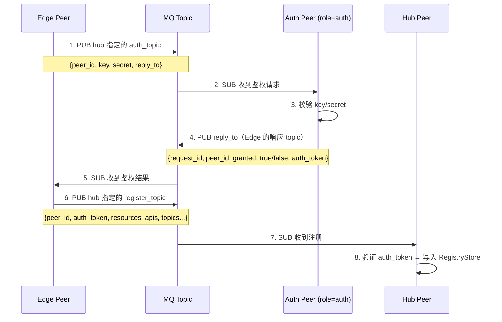
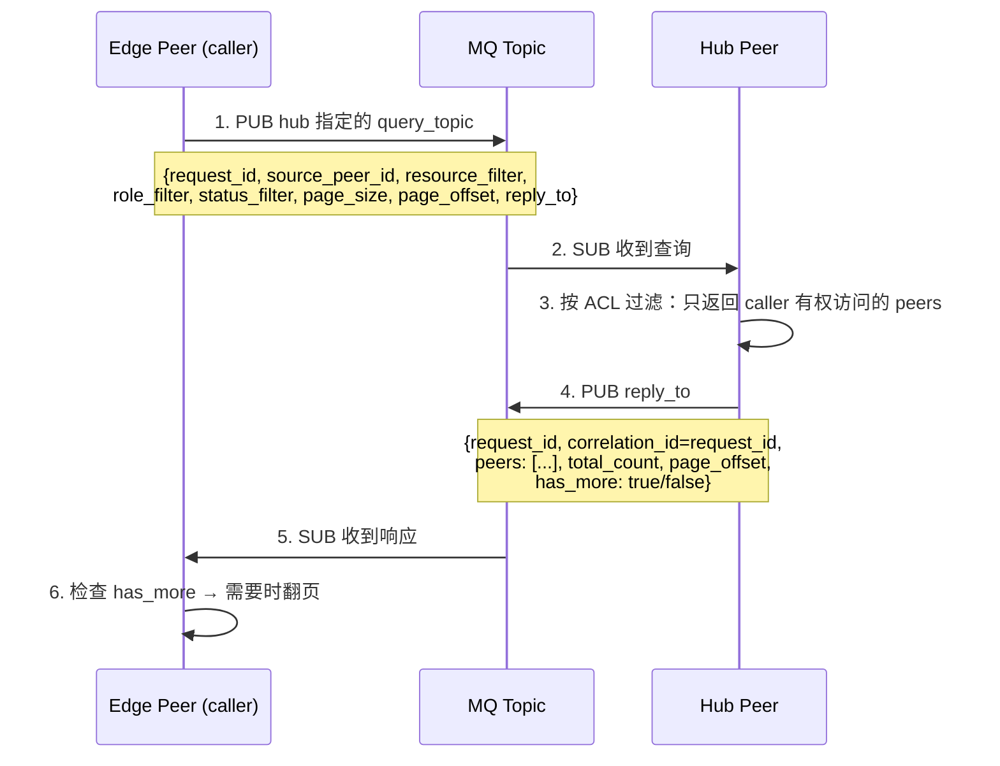
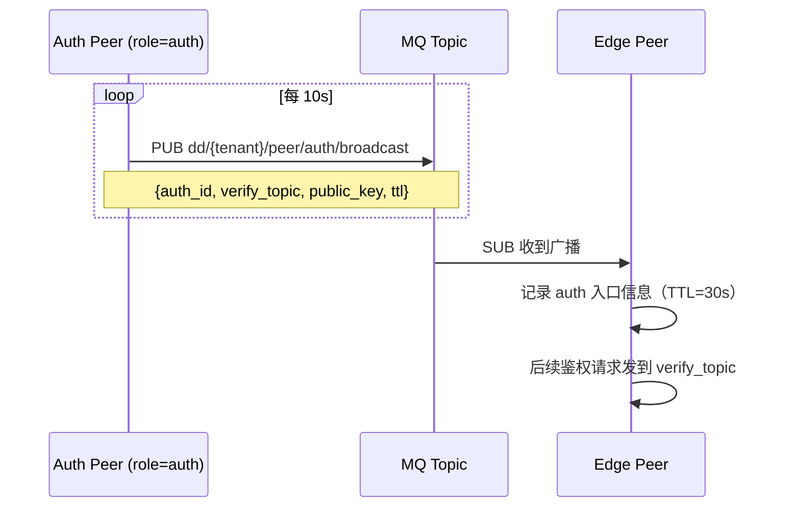

# DD Core v1.2 分布式资源注册设计方案

## 1. 设计目标

本文档定义 DD Core 中 **分布式资源注册** 的完整流程，覆盖三个核心能力：

1. **Hub 发现**：`role=hub` 的 peer 通过 MQ 定期广播自身入口 topic，其他 peer 订阅后自动发现 hub
2. **安全的资源注册**：peer 注册资源前，通过 `role=auth` 的 peer 完成身份校验，再向 hub 注册
3. **ACL 驱动的 peer 列表查询**：peer 通过 MQ 发布 ACL 敏感查询，hub 按 correlation 策略分页返回可访问的 peer 列表

**不覆盖**：token 签发/验证、JWT、challenge-response 握手、凭证轮换等——这些属于后续的 Auth Token 设计范畴。

---

## 2. 角色定义

| 角色 | 职责 |
|---|---|
| `hub` | 定期广播入口 topic；接收 peer 注册并维护全局注册表；响应 ACL 查询 |
| `auth` | Hub 的鉴权代理；验证 peer 身份（key/secret）；签发注册许可 |
| `edge` | 订阅 hub 广播；通过 auth 鉴权后向 hub 注册资源；发布 ACL 查询获取 peer 列表 |
| `edge_hub` | 同时具备 edge 和 hub 能力 |

---

## 3. 流程一：Hub 广播与发现

### 3.1 流程



### 3.2 广播消息结构

```json
{
  "hub_id": "hub-01",
  "hub_name": "DD Hub",
  "register_topic": "dd/default/peer/resource/register",
  "auth_topic": "dd/default/peer/auth/verify",
  "query_topic": "dd/default/peer/list/query",
  "ttl_sec": 30,
  "timestamp": "2026-04-29T12:00:00Z"
}
```

### 3.3 Topic 定义

| Topic | 方向 | 用途 |
|---|---|---|
| `dd/{tenant}/peer/hub/broadcast` | hub→all | hub 定期广播入口信息 |

### 3.4 要点

- hub 每 **10s** 广播一次（可配），消息 `ttl_sec=30`（三倍广播间隔，容错）；
- edge 订阅 `dd/+/peer/hub/broadcast` 覆盖所有租户（或限定为 `dd/{tenant}/peer/hub/broadcast`）；
- edge 发现多个 hub 时选择最新广播时序的作为主 hub；
- `timestamp` 用于 edge 判断 hub 存活。

---

## 4. 流程二：Auth 鉴权与资源注册

### 4.1 流程



### 4.2 鉴权请求

```json
{
  "request_id": "auth-req-001",
  "peer_id": "edge-01",
  "key": "edge-01-key",
  "secret": "edge-01-secret",
  "reply_to": "dd/default/transfer/edge-01/response"
}
```

### 4.3 鉴权响应

```json
{
  "request_id": "auth-req-001",
  "peer_id": "edge-01",
  "granted": true,
  "auth_token": "hub-granted-token-base64",
  "ttl_sec": 300,
  "reason": ""
}
```

- `granted: false` 时 `reason` 说明拒绝原因
- `auth_token` 由 auth peer 签发，hub 收到注册时用其验证

### 4.4 注册请求（携带 auth_token）

```json
{
  "request_id": "reg-001",
  "peer_id": "edge-01",
  "peer_name": "Edge Node 01",
  "role": "edge",
  "auth_token": "hub-granted-token-base64",
  "resources": {
    "apis": [{"name": "order.query", "path": "/order/{id}", "method": "GET"}],
    "topics": [{"name": "iot.temp", "mode": "pub"}],
    "streams": [{"name": "camera.main", "protocol": "rtsp", "path": "rtsp://..."}]
  }
}
```

### 4.5 Topic 定义

| Topic | 方向 | 用途 |
|---|---|---|
| `dd/{tenant}/peer/auth/verify` | edge→auth | peer 身份鉴权请求（hub 广播中指定） |
| `dd/{tenant}/peer/resource/register` | edge→hub | peer 资源注册（hub 广播中指定） |

### 4.6 已有 topic（沿用）

| Topic | 用途 |
|---|---|
| `dd/{tenant}/peer/register` | peer 注册（已有，保留兼容） |
| `dd/{tenant}/peer/heartbeat` | peer 心跳（已有） |
| `dd/{tenant}/peer/unregister` | peer 注销（已有） |

---

## 5. 流程三：ACL 驱动的 Peer 列表查询

### 5.1 流程



### 5.2 查询请求

```json
{
  "request_id": "query-001",
  "source_peer_id": "edge-01",
  "resource_filter": "order.query",
  "role_filter": "edge",
  "status_filter": "active",
  "page_size": 20,
  "page_offset": 0,
  "reply_to": "dd/default/transfer/edge-01/response"
}
```

### 5.3 查询响应（分页）

```json
{
  "request_id": "query-001",
  "correlation_id": "query-001",
  "peers": [
    {
      "id": "edge-02",
      "name": "Edge Node 02",
      "role": "edge",
      "status": "active",
      "resources": ["order.query", "sensor.temp"],
      "tags": {"region": "us-east"}
    }
  ],
  "total_count": 42,
  "page_offset": 0,
  "has_more": true
}
```

### 5.4 ACL 过滤规则

hub 在返回 peer 列表前，执行 ACL 过滤：

```
1. 读取 caller_peer_id（source_peer_id）
2. 读取 caller 的 ACL rules（来自 TopicAclService）
3. 对每个候选 peer：
   a. 检查 peer 的 resource 是否在 ACL allow 列表中 → 否：过滤
   b. 检查 peer 的 role 是否匹配 role_filter → 否：过滤
   c. 检查 peer 的 status 是否匹配 status_filter → 否：过滤
4. 排序 + 分页截断
5. 返回结果 + has_more 分页标记
```

### 5.5 使用 DdDataService 的 correlation 机制

查询请求复用现有的 `DdDataService.SendSync`：
- `requestTopic` = hub 广播的 `query_topic`
- `replyTo` = caller 自身的 response topic
- `timeoutMs` = 3000（默认）
- hub 响应中 `correlationId` = `requestId`，caller 的 `DdDataService` 自动匹配

### 5.6 Topic 定义

| Topic | 方向 | 用途 |
|---|---|---|
| `dd/{tenant}/peer/list/query` | edge→hub | peer 列表查询（hub 广播中指定） |

---

## 6. 流程四：Auth Server 广播

### 6.1 流程



### 6.2 广播消息结构

```json
{
  "auth_id": "auth-01",
  "auth_name": "DD Auth Server",
  "verify_topic": "dd/default/peer/auth/verify",
  "public_key": "base64-encoded-public-key",
  "ttl_sec": 30,
  "timestamp": "2026-04-29T12:00:00Z"
}
```

### 6.3 与 Hub 广播的差异

| 维度 | Hub 广播 | Auth 广播 |
|---|---|---|
| 广播者 | `role=hub` | `role=auth` |
| Topic | `dd/{tenant}/peer/hub/broadcast` | `dd/{tenant}/peer/auth/broadcast` |
| 内容 | register_topic, query_topic | verify_topic, public_key |
| 用途 | 资源注册入口发现 | 鉴权入口发现 |

### 6.4 Topic 定义

| Topic | 方向 | 用途 |
|---|---|---|
| `dd/{tenant}/peer/auth/broadcast` | auth→all | auth 定期广播入口信息 |

---

## 7. 消息模型扩展

### 7.1 新增消息类型（`internal/model/dd_resource_events.go`）

```go
package model

import "time"

type HubBroadcast struct {
    HubId         string `json:"hub_id"`
    HubName       string `json:"hub_name"`
    RegisterTopic string `json:"register_topic"`
    AuthTopic     string `json:"auth_topic"`
    QueryTopic    string `json:"query_topic"`
    TtlSec        int    `json:"ttl_sec"`
    Timestamp     time.Time `json:"timestamp"`
}

type AuthBroadcast struct {
    AuthId      string `json:"auth_id"`
    AuthName    string `json:"auth_name"`
    VerifyTopic string `json:"verify_topic"`
    PublicKey   string `json:"public_key"`
    TtlSec      int    `json:"ttl_sec"`
    Timestamp   time.Time `json:"timestamp"`
}

type PeerAuthRequest struct {
    RequestId string `json:"request_id"`
    PeerId    string `json:"peer_id"`
    Key       string `json:"key"`
    Secret    string `json:"secret"`
    ReplyTo   string `json:"reply_to"`
}

type PeerAuthResponse struct {
    RequestId string `json:"request_id"`
    PeerId    string `json:"peer_id"`
    Granted   bool   `json:"granted"`
    AuthToken string `json:"auth_token"`
    TtlSec    int    `json:"ttl_sec"`
    Reason    string `json:"reason,omitempty"`
}

type PeerResourceRegisterRequest struct {
    RequestId string `json:"request_id"`
    PeerId    string `json:"peer_id"`
    PeerName  string `json:"peer_name"`
    Role      string `json:"role"`
    AuthToken string `json:"auth_token"`
    Resources struct {
        Apis    []map[string]string `json:"apis"`
        Topics  []map[string]string `json:"topics"`
        Streams []map[string]string `json:"streams"`
    } `json:"resources"`
}

type PeerListQuery struct {
    RequestId      string `json:"request_id"`
    SourcePeerId   string `json:"source_peer_id"`
    ResourceFilter string `json:"resource_filter,omitempty"`
    RoleFilter     string `json:"role_filter,omitempty"`
    StatusFilter   string `json:"status_filter,omitempty"`
    PageSize       int    `json:"page_size"`
    PageOffset     int    `json:"page_offset"`
    ReplyTo        string `json:"reply_to"`
}

type PeerListResponse struct {
    RequestId     string        `json:"request_id"`
    CorrelationId string        `json:"correlation_id"`
    Peers         []DdPeerInfo  `json:"peers"`
    TotalCount    int           `json:"total_count"`
    PageOffset    int           `json:"page_offset"`
    HasMore       bool          `json:"has_more"`
}
```

### 7.2 TopicSet 扩展（`internal/service/topics.go`）

```go
type TopicSet struct {
    // ... 现有字段 ...
    HubBroadcast  string
    AuthBroadcast string
}
```

---

## 8. 广播生命周期管理

### 8.1 Hub 侧

```go
type HubDiscoveryService struct {
    mqClient    mq.Client
    hubId       string
    peerId      string
    topics      service.TopicSet
    interval    time.Duration
    ttlSec      int
}

func (s *HubDiscoveryService) Start(ctx context.Context) {
    ticker := time.NewTicker(s.interval)
    defer ticker.Stop()
    for {
        select {
        case <-ctx.Done():
            return
        case <-ticker.C:
            s.broadcast()
        }
    }
}

func (s *HubDiscoveryService) broadcast() {
    msg := model.HubBroadcast{
        HubId:         s.hubId,
        RegisterTopic: s.topics.PeerResourceReport,
        AuthTopic:     "dd/" + s.peerId + "/peer/auth/verify",
        QueryTopic:    "dd/" + s.peerId + "/peer/list/query",
        TtlSec:        s.ttlSec,
        Timestamp:     time.Now().UTC(),
    }
    data, _ := json.Marshal(msg)
    s.mqClient.Publish(context.Background(), s.topics.HubBroadcast, data)
}
```

### 8.2 Edge 侧

```go
type HubDiscoveryClient struct {
    activeHubs map[string]HubBroadcast
    mu         sync.RWMutex
}
func (c *HubDiscoveryClient) handleBroadcast(msg HubBroadcast) {
    c.mu.Lock()
    c.activeHubs[msg.HubId] = msg
    c.mu.Unlock()
}

func (c *HubDiscoveryClient) GetActiveHub() (HubBroadcast, bool) {
    c.mu.RLock()
    defer c.mu.RUnlock()
    now := time.Now().UTC()
    for _, h := range c.activeHubs {
        if now.Sub(h.Timestamp) <= time.Duration(h.TtlSec)*time.Second {
            return h, true
        }
    }
    return HubBroadcast{}, false
}
```

---

## 9. 鉴权服务（Auth Peer）

### 9.1 职责

- 预配置 `key → secret` 映射（静态配置或 hub 同步）
- 收到 `PeerAuthRequest` 后校验 key/secret
- 签发 `auth_token`（base64 编码的 `HMAC-SHA256(peerId + nonce, auth_secret)`）
- 定期广播自身入口（同 hub 广播模式）

### 9.2 实现骨架

```go
type AuthPeerService struct {
    mqClient    mq.Client
    secrets     map[string]string // key → secret
}

func (s *AuthPeerService) handleVerifyReq(topic string, payload []byte) {
    var req model.PeerAuthRequest
    json.Unmarshal(payload, &req)

    expectedSecret, ok := s.secrets[req.Key]
    if !ok || expectedSecret != req.Secret {
        s.replyAuth(req, false, "", "invalid key/secret")
        return
    }

    token := generateAuthToken(req.PeerId, expectedSecret)
    s.replyAuth(req, true, token, "")
}

func (s *AuthPeerService) replyAuth(req model.PeerAuthRequest, granted bool, token, reason string) {
    resp := model.PeerAuthResponse{RequestId: req.RequestId, PeerId: req.PeerId,
        Granted: granted, AuthToken: token, Reason: reason, TtlSec: 300}
    data, _ := json.Marshal(resp)
    s.mqClient.Publish(context.Background(), req.ReplyTo, data)
}
```

---

## 10. 配置变更

```yaml
# config.yaml 新增字段
peer:
  broadcast:
    interval_sec: 10       # 广播间隔
    ttl_sec: 30            # 消息有效期

  auth:
    key: ""                # peer 的 key 标识
    secret: ""             # peer 的 secret
    verify_topic_suffix: "/peer/auth/verify"  # 鉴权 topic 后缀

  query:
    default_page_size: 20
    max_page_size: 100
    timeout_ms: 3000
```

---

## 11. 实现计划（v1.2.x）

| Wave | 内容 | 交付物 |
|---|---|---|
| **R1** | Hub 广播 + Edge 发现 + `HubDiscoveryService` | `internal/service/hub_discovery*.go` |
| **R2** | Auth Peer 鉴权 + `PeerAuthRequest/Response` 模型 | `internal/model/dd_resource_events.go` |
| **R3** | ACL Peer 列表查询 + 分页 response | `internal/service/peer_list_service.go` |
| **R4** | Auth Server 广播 | 扩展 `HubDiscoveryService` 为通用广播组件 |
| **R5** | topics.go / config.go / cmd/main.go 集成 + 测试 | 全部串联 |

---

## 12. 关键设计决策

| 决策项 | 方案 | 理由 |
|---|---|---|
| Hub 发现方式 | 定期广播（push） | edge 无需主动轮询，低延迟发现 |
| Hub 离线检测 | TTL 过期（3x 间隔） | 简单，不需要心跳 |
| 鉴权模型 | 独立 auth peer（role=auth） | 鉴权逻辑与 hub 解耦，可独立扩缩 |
| 查询分页 | page_size/offset | 类 HTTP，简单直观 |
| 查询匹配 | correlation_id = request_id | 复用现有 `DdDataService.SendSync` |
| auth_token 格式 | base64 HMAC-SHA256 | 简单，无 JWT 依赖 |
| 广播组件 | hub/auth 共用广播模式 | 统一实现，减少重复代码 |
