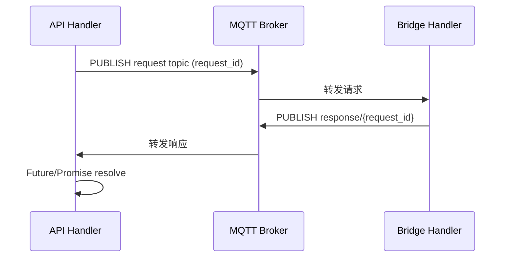

# DD Core 技术方案设计 v1.3（异构网络传输优化版）

## 1. 文档目的

本文档基于 `docs/analysis-bridge-protocol-v1.md` 第 5.1 节（数据传输路径与跳数放大）分析结果，给出在“必须经由 Broker 中转”的前提下，面向异构网络（窄带、跨地域、高时延链路）的优化设计。

设计目标：

1. 降低同步调用逻辑跳数与端到端延迟；
2. 降低单次消息传输体积与 ACK 负担；
3. 在不破坏现有 Broker 拓扑的前提下，引入同域直连旁路能力；
4. 通过 QoS 分层策略平衡可靠性、延迟与带宽。

---

## 2. 现状与问题定义（承接 5.1）

当前 Sync 路径在 MQTT 层面为：

```text
请求方向: API -> Broker -> Bridge
响应方向: Bridge -> Broker -> API
```

在 QoS 1 下，一次完整 Sync 调用对应：

- 4 次 PUBLISH 中转；
- 4 次 PUBACK；
- 端到端逻辑开销等价于在 MQTT 上实现阻塞 RPC。

根据分析报告示例（50B 有效载荷），Sync 单次总传输约 `2312B`，有效数据占比约 `2.2%`，主要问题为：

1. 跳数放大导致 RTT 累加；
2. JSON 信封字段冗余导致小消息膨胀严重；
3. 统一 QoS 1 使低价值流量承担不必要确认成本。

---

## 3. 优化总览与优先级

| 优先级 | 优化方向 | 核心策略 |
|---|---|---|
| P1 | 减少逻辑跳数 | Sync 阻塞 RPC 重构为“关联 ID 的异步响应合并” |
| P1 | 减少单次体积 | 动态字段裁剪 + 全信封压缩（gzip/zstd） |
| P2 | 减少固定开销 | MQTT 5.0 Topic Alias |
| P2 | 降低确认成本 | QoS 分层（关键 QoS1，非关键 QoS0） |
| P3 | 路径智能化 | 同域旁路直连、跨域继续 Broker 中转 |

---

## 4. P1：减少逻辑跳数（请求-响应模式重构）

### 4.1 设计原则

将当前“API 侧同步阻塞等待 channel”模型重构为“异步请求 + 关联 ID 回调/Future”模型。  
保持 Broker 拓扑不变，不要求 API 与 Bridge 网络直连。

### 4.2 目标流程（关联 ID 异步响应合并）



关键点：

1. API 发布 `Async Request` 到 `request` topic（1 次中转）；
2. API 按 `request_id` 监听 `response/{request_id}`（或共享订阅统一响应流）；
3. Bridge 完成处理后发布响应到 `response/{request_id}`（1 次中转）；
4. API 通过消息回调/Reactive Streams 将结果封装为 `Future/Promise` 返回上层。

### 4.3 接口改造建议（DdDataService）

新增异步能力（命名可按代码风格调整）：

- `SendSyncAsync(ctx, req) -> CompletableFuture[Response]`（Go 中可用 `chan result` + 封装 Future）
- 或 `SendWithCallback(ctx, req, onResult)`。

保留兼容层：

- 原 `SendSync` 由 `SendSyncAsync` 派生实现：在上层执行 `Await(timeout)`，避免一次性改动所有调用方。

### 4.4 预期收益

1. Broker 逻辑中转：`4 -> 2`（请求转发 + 响应转发）；
2. ACK 数：`4 -> 2`（若异步响应允许 QoS 0，可进一步降低）；
3. 延迟模型：  
   - 旧：`2*RTT(API-Broker) + 2*RTT(Broker-Bridge)`  
   - 新：`RTT(API-Broker) + RTT(Broker-Bridge)`。

### 4.5 代价与兼容性

1. 同步调用方需适配 Future/Promise 或 callback；
2. 需要增加 `request_id -> pending future` 生命周期管理；
3. 需要补充超时回收和取消传播逻辑。

---

## 5. P1：减少单次传输体积（面向异构链路的协议精简）

### 5.1 动态字段裁剪（Context-aware Payload）

`DdMessage` 在不同方向携带字段应最小化，避免“某一跳无用字段”跨网传输。

| 字段 | 上行（API -> Broker -> Bridge） | 下行（Bridge -> Broker -> API） | 单次节省估算 |
|---|---|---|---|
| `reply_to`/`correlation_id`/`source_peer_id` | 保留 | 省略或由路由侧补齐 | ~80B |
| `timeout_ms` | 保留 | 可省略 | ~10B |
| `headers.method/path` | 保留 | 响应可省略 | ~30B |

实施建议：

1. 在序列化层引入按方向/模式切换的 `view profile`（例如 `sync_upstream`, `sync_downstream`, `async_event`）；
2. 在 `DdDataService` 请求发送和 Bridge 响应构建时选择对应 profile；
3. 仅保留响应匹配和审计必需字段。

### 5.2 全信封压缩（gzip/zstd）

压缩对象应为“完整序列化字节流（envelope）”，而不仅是业务 payload。

原因：

1. 小消息 payload 本身压缩收益有限；
2. 信封元数据占比高，压缩全体收益更稳定。

策略建议：

1. 默认启用 `gzip`，在可控 CPU 环境启用 `zstd`；
2. 设置压缩阈值（如 `>128B` 或可配置阈值）以避免超小包压缩抖动；
3. 通过 header 标记编码（如 `content-encoding: gzip|zstd`）；
4. 失败自动回退明文，避免可用性受损。

预期：

- 典型 570B 信封可压缩到 200B 以下；
- 在旧 Sync 4 跳模型下，累计传输从约 2300B 降至约 1000B；
- 与 P1 跳数优化叠加后收益更显著。

### 5.3 MQTT 5.0 Topic Alias（依赖 Broker 升级）

将长 topic（例如 `dd/{tenant}/transfer/{resource}/request`）映射为短整数别名。

收益：

1. 单条 PUBLISH 约节省 `~38B` topic 长度；
2. 旧 4 次中转可累计节省 `~152B`（约总量 6.5%）；
3. 对业务代码侵入小，属于低成本优化。

落地前提：

1. Broker 与客户端均升级到 MQTT 5.0；
2. 在 `mq client` 层增加 alias 建立与复用策略。

---

## 6. P3：智能混合路由（同域旁路，跨域代理）

### 6.1 设计目标

在异构网络总体场景下，保留 Broker 跨域可达性，同时让同域通信自动走低延迟旁路。

### 6.2 路由决策模型

在 Hub 发现或静态配置阶段，为每个 peer 增加可达域属性，例如：

```json
{
  "peer_id": "edge-01",
  "region": "internal",
  "network": "lan1",
  "direct_protocols": ["http", "coap"]
}
```

策略：

1. API 与目标 Bridge 同域（同 `region/network`）时，优先 `HTTP/CoAP` 直连（P2P 数据面）；
2. 跨域或不可达时，回退 `Broker` 中转；
3. 直连仅在 Hub 显式授权策略命中时启用。

### 6.3 实施位置

在 `DdDataService.SendSync` 之前增加路由决策层：

1. 查询 `Peer Registrar` 的网络域与可达能力；
2. 选择 `direct` 或 `broker` 路径；
3. 统一记录路由决策日志与指标（命中率、回退率、失败率）。

---

## 7. QoS 分层策略（异构网络可靠性权衡）

不建议简单将全部 Sync 流量降为 QoS 0，应按消息价值分层。

| 消息类型 | 建议 QoS | 原因 |
|---|---|---|
| Sync 请求 | QoS 1 | 保证请求到达，减少“无感丢失” |
| Sync 响应 | QoS 1 | 保证响应返回，避免超时重试放大 |
| Async 事件（非关键） | QoS 0 | 允许丢失，换低延迟和低带宽 |
| Heartbeat/资源上报 | QoS 0 | 周期性可恢复，单次丢失可容忍 |

收益说明：

1. QoS 0 消除 PUBACK（每次交互减少确认包）；
2. 对高频后台流（heartbeat/async）可显著降低 Broker 压力；
3. 与压缩和字段裁剪组合后，异构网络链路收益可叠加。

---

## 8. 分阶段落地计划

### 阶段 A（P1，2~3 周）

1. 引入 `SendSyncAsync` 能力与兼容包装；
2. 实现响应关联订阅（`response/{request_id}` 或共享流匹配）；
3. 上线方向化字段裁剪 profile；
4. 上线全信封压缩（默认 gzip，可配置 zstd）。

### 阶段 B（P2，1~2 周）

1. 定义并发布 QoS 分层策略；
2. 将 async/heartbeat 流量切换至 QoS 0；
3. 完成 MQTT 5.0 升级评估与 Topic Alias PoC。

### 阶段 C（P3，2~4 周）

1. 扩展 peer 注册模型（网络域/可达能力）；
2. 增加路由决策层与授权门禁；
3. 灰度开启同域直连，保留 Broker 回退。

---

## 9. 验收指标（SLO）

上线后至少观察以下指标：

1. `sync_end_to_end_p95_latency`：较基线下降 >= 30%；
2. `sync_message_bytes_per_request`：较基线下降 >= 40%；
3. `broker_publish_total`（Sync 相关）：单请求 publish 次数下降约 50%；
4. `compression_ratio`：小消息场景平均压缩率 >= 45%；
5. `route_direct_hit_ratio`（同域场景）：>= 70%（按灰度目标调整）；
6. `timeout_retry_rate`：不得高于基线（确保可靠性不倒退）。

---

## 10. 总结

在“Broker 中转用于异构网络可达性”这一前提下，v1.3 的优化路径为：

1. 先重构 Sync 为“异步请求 + 关联响应”，优先消除逻辑跳数放大；
2. 同步实施字段裁剪与全信封压缩，降低每跳字节成本；
3. 推动 MQTT 5.0 + Topic Alias，持续消除固定 topic 开销；
4. 引入网络域感知路由，在同域内自动旁路直连；
5. 通过 QoS 分层将可靠性留给关键流量，把带宽让给高频非关键流量。

该方案不要求改变既有 Broker 拓扑，能以较低迁移风险获得可观的延迟与带宽收益，适合作为下一阶段协议与传输层优化主线。

---

## 11. 与 v1.0 对照关系（评审索引）

为便于评审与实施拆解，本节给出 `docs/design-v1.0.md` 与本版（v1.3）的章节映射。

| v1.0 基线章节 | v1.3 增量章节 | 评审关注点 |
|---|---|---|
| `4.2 Sync 调用实现（request/reply）` | `4. P1：减少逻辑跳数` | 是否完成从阻塞等待到异步关联回包的接口与调用方迁移 |
| `4.1 Topic 设计` | `4.2 目标流程`、`5.3 Topic Alias` | 是否引入 `response/{request_id}` 或统一响应流策略；MQTT 5.0 能力是否具备 |
| `2.3 DD 责任边界`、`4.2 timeout 语义` | `4.3 接口改造建议`、`4.5 兼容性` | `SendSyncAsync` 增量是否保持旧 `SendSync` 兼容行为 |
| `4.* 消息头约定` | `5.1 动态字段裁剪` | 字段裁剪后是否仍满足响应匹配、审计、追踪需求 |
| `6. 可靠性与性能职责矩阵` | `7. QoS 分层策略` | QoS 降级范围是否严格限定在非关键流量 |
| `5. 服务发现实现` | `6. P3 智能混合路由` | peer 元数据是否新增网络域，是否有同域直连授权门禁 |
| `9. 工程实现清单` | `8. 分阶段落地计划`、`9. 验收指标` | 每阶段是否具备可上线、可观测、可回滚的验收标准 |

实施建议按“先 P1（跳数+体积）再 P2（协议能力）后 P3（路由智能化）”顺序推进，避免多维改动并发导致定位困难。

---

## 12. `DdMessage` 信封模型评估与优化（补充）

本节针对 `internal/model/dd_message.go` 的两个问题给出结论与优化方案。

### 12.1 `RequestId` / `CorrelationId` / `TraceId` 是否冗余

结论：**三者不完全冗余，但当前语义边界不清，存在可精简空间。**

#### 12.1.1 现状评估

1. `RequestId`：当前是请求主键，`SendSync` 等待队列、状态记录、幂等链路都依赖它；
2. `CorrelationId`：当前主要用于响应关联（Bridge 响应中回填请求 ID），`SubscribeSyncResponses` 优先用它匹配 pending；
3. `TraceId`：字段已定义，但在 API 构建、Bridge 透传、链路追踪中基本未形成闭环（当前等价“未启用”）。

#### 12.1.2 冗余判断

1. `RequestId` 与 `CorrelationId`：  
   - 在“请求消息”中可合并（通常只需要一个 ID）；  
   - 在“响应消息”中不建议合并，保留 `correlation_id -> request_id` 更清晰，也兼容未来一对多/重试回包场景。  
2. `TraceId`：与前两者语义不同（观测链路 vs 业务关联），**概念不冗余**；但在未接入 tracing 前，传输层可按需裁剪。

#### 12.1.3 优化方案（兼容优先）

定义“按方向/模式字段最小集”：

- Sync 请求：`request_id` 必填，`correlation_id` 省略，`trace_id` 可选；
- Sync 响应：`correlation_id` 必填（=原请求 `request_id`），`request_id` 可选；
- Async 事件：`request_id` 可选（用于审计），`correlation_id` 省略；
- 当 tracing 未启用：`trace_id` 默认不传；启用后改为“入口生成、全链路透传”。

兼容策略：

1. v1.3 保持现有字段不删，仅做序列化裁剪；
2. 解析端维持兜底逻辑（优先 `correlation_id`，回退 `request_id`）；
3. 在 v1.4 再评估是否引入 `message_id`（替代响应侧 `request_id`）并正式弃用旧语义。

### 12.2 `DdMessage` 中两个 Header 是否冗余

结论：**语义上不冗余，设计上有冗余成本。**

`DdMessage` 当前同时包含：

1. `Header DdHeader`：协议无关传输元数据（request/reply/tenant/timeout 等）；
2. `Headers map[string]string`：协议相关头（如 HTTP `method/path/content-type`）。

二者职责不同，但存在问题：

1. 名称过于接近（`Header` vs `Headers`）导致误用；
2. `map[string]string` 缺乏类型约束，字段漂移风险高；
3. 小消息场景下，双层 header 增加信封体积与编码成本。

### 12.3 结构优化方案

#### 12.3.1 模型重构（建议）

将模型拆为“传输元数据 + 协议元数据”，避免双 Header 命名冲突，并明确 `Headers` 仅承载协议特定字段：

- `meta`：原 `DdHeader`（请求关联、超时、路由、租户等）；
- `protocol_meta`：按协议承载最小字段；
- `ext`：保留扩展键值（可选）。

> 约束：`protocol_meta` 之外不得出现协议字段。  
> 例如 HTTP 的 `method/path/content-type` 不能再混入 `meta`，也不能以自由 key 形式散落在 `ext`。

示意（仅设计草案）：

```json
{
  "mode": "sync",
  "protocol": "http",
  "resource": "sensor/temperature",
  "meta": {
    "request_id": "req-xxx",
    "correlation_id": "",
    "reply_to": "...",
    "timeout_ms": 3000
  },
  "protocol_meta": {
    "http": {
      "method": "GET",
      "path": "/api/v1/sensor/temperature",
      "content_type": "application/json"
    }
  }
}
```

#### 12.3.2 序列化精简策略

1. 请求方向仅携带请求必需 `meta` + 当前协议必需 `protocol_meta`；
2. 响应方向移除无意义请求字段（如 `method/path/timeout_ms`）；
3. `ext` 默认关闭，仅在跨系统透传场景开启。

#### 12.3.3 协议字段白名单（v1.3 明确规则）

`protocol_meta` 为协议专属字段，采用“白名单 + 校验失败拒绝”策略。

1. HTTP：
   - 允许：`method`、`path`、`query`、`content_type`、`headers`（仅 HTTP 头）；
   - 禁止：将上述字段放入 `meta` 或顶层自由 map。
2. CoAP：
   - 允许：`method`、`path`、`content_format`、`token`、`observe`；
   - 禁止：复用 HTTP 命名（如 `content-type`）造成语义混淆。
3. MQ：
   - 允许：`topic`、`qos`、`retain`、`partition_key`（若适用）；
4. Stream：
   - 允许：`stream_id`、`profile`、`subproto`、`chunk_seq`。

实现建议：

1. 增加 `ValidateProtocolMeta(protocol, protocol_meta)`；
2. bridge 适配器只读取对应协议 namespace；
3. 非白名单字段统一进入告警计数，并按策略拒绝或裁剪。

#### 12.3.4 与现网 `Headers map[string]string` 的迁移

为兼容当前实现（`msg.Headers["method"]` / `msg.Headers["path"]`），采用“三阶段迁移”：

1. 阶段 1：写新读旧  
   - 发送端双写：`protocol_meta` + 旧 `Headers`；
   - 接收端优先读 `protocol_meta`，缺失时回退 `Headers`。
2. 阶段 2：写新读新（灰度）  
   - 通过 capability 标记仅对已升级 peer 停止写旧 `Headers`。
3. 阶段 3：移除旧字段  
   - 删除 `Headers map[string]string` 或仅保留受控 `ext_headers`。

### 12.4 分阶段落地（与 v1.3 主计划对齐）

1. **阶段 A（立即）**：保留现有结构，仅增加“字段最小集裁剪规则”；
2. **阶段 B（短期）**：引入新命名别名（`meta/protocol_meta`）并双写兼容；
3. **阶段 C（中期）**：消费端全部切换后，下线 `Headers map[string]string` 非白名单用法，保留受控扩展位；
4. **阶段 D（长期）**：配合 tracing 落地，强制 `trace_id` 透传与采样策略。

### 12.5 预期收益

1. 进一步减少小消息信封体积（请求/响应方向化后可再降约 8%~18%，视协议头数量而定）；
2. 降低协议适配器的解析歧义和字段漂移；
3. 为异步关联模型、链路追踪、协议演进（MQTT5/二进制编码）提供稳定元数据基础。

---

## 13. `DdPeer` 资源请求元数据的声明式注册

当前 `DdPeerInfo.Resources` 仅保存资源名列表（`[]string`），`PeerResourceReport` 也主要承载资源清单，尚不能表达“该资源请求需要哪些 meta 字段、哪些是必填、哪些可选”。

为支持资源级治理与参数校验，v1.3 增加“声明式请求元数据注册”。

### 13.1 目标

1. 让每个 `DdPeer` 对其提供的 `resource` 声明请求契约；
2. 在请求入口（API/Bridge）进行前置校验，减少无效跨网调用；
3. 为路由、ACL、QoS、超时策略提供资源级策略输入。

### 13.2 数据模型（建议）

在 peer 资源注册中新增 `request_meta_schema`：

```json
{
  "peer_id": "edge-01",
  "resources": {
    "apis": [
      {
        "name": "sensor.temperature.read",
        "protocol": "http",
        "request_meta_schema": {
          "required": ["source_peer_id", "target_peer_id", "timeout_ms"],
          "optional": ["trace_id", "idempotency_key"],
          "constraints": {
            "timeout_ms": {"min": 100, "max": 10000},
            "qos": {"enum": [0, 1]}
          },
          "protocol_meta_required": ["method", "path"]
        }
      }
    ]
  }
}
```

字段说明：

1. `required/optional`：声明 `meta` 层字段要求；
2. `constraints`：声明取值范围、枚举或正则；
3. `protocol_meta_required`：声明协议专属必填字段；
4. 允许按资源覆盖默认策略（如 timeout、qos）。

### 13.3 注册与生效流程

1. `DdPeer` 启动时上报资源与 `request_meta_schema`（随 register/report 事件）；
2. Hub/Registry 存储为 `resource -> provider -> schema`；
3. API Handler 在 `SendSync/SendAsync` 前先做本地或 hub 缓存校验；
4. Bridge 侧做二次校验（防止绕过入口）；
5. 校验失败返回标准错误码（如 `invalid_meta_schema` / `missing_required_meta`）。

### 13.4 与现有模型兼容策略

1. 对旧 peer：无 schema 时按“宽松模式”处理，仅走基础 `DdMessage.Validate()`；
2. 对新 peer：有 schema 时进入“严格模式”，启用资源级校验；
3. 注册中心按 capability 标识区分：
   - `capabilities` 包含 `resource_meta_schema_v1` -> 严格模式；
   - 缺失 -> 宽松兼容。

### 13.5 工程改造点

1. `internal/model/dd_peer_info.go`：
   - 扩展资源声明结构（从 `[]string` 演进到结构化 descriptor，可保留兼容字段）。
2. `internal/model/dd_peer_events.go`：
   - 为 `DdPeerResourceReportEvent` 增加 schema 字段；
3. `internal/service/peer_registry_service.go`：
   - 存储并索引 `request_meta_schema`；
4. `api/handler.go` 与 `internal/service/dd_data_service.go`：
   - 发送前按资源 schema 校验 `meta/protocol_meta`；
5. 观测：
   - 新增指标：`resource_meta_validate_total{resource,result}`。

### 13.6 预期收益

1. 提前拦截无效请求，减少跨网无效流量；
2. 统一资源调用契约，降低协议适配分叉；
3. 为后续自动路由、自动超时/QoS 推荐提供机器可读输入。

---

## 14. `cmd/main.go` 的协议资源访问入口（HTTP API）

针对控制面可观测与资源治理，`cmd/main.go` 启动的 HTTP API 需明确提供三类资源访问入口：

1. HTTP 资源访问入口；
2. MQTT 资源访问入口（重点：发布/订阅 topic 资源）；
3. CoAP 资源访问入口。

### 14.1 现状与缺口

当前已存在通用资源接口（如 `/resources`、`/resources/{resource}/providers`），但缺少“按协议聚合视图”的能力，导致：

1. 无法直接区分某资源是 HTTP 端点、MQTT topic 还是 CoAP resource；
2. 无法针对 MQTT 输出 pub/sub 方向、QoS、retain 等关键属性；
3. 无法为 API 网关或运维面板提供协议化查询入口。

### 14.2 `main.go` 启动职责（新增要求）

`main.go` 在构建 `api.NewServer(...)` 前，应组装并注入“协议资源索引服务”（名称可调整，如 `ProtocolResourceIndex`），其数据来自：

1. `PeerRegistry` 的资源声明与 `request_meta_schema`；
2. 桥接配置（HTTP target、CoAP target、MQTT mappings）；
3. 运行期发现数据（可选：hub/resource report 增量同步）。

该索引服务职责：

1. 维护 `protocol -> resource descriptors` 快照；
2. 支持按 `resource/peer_id/role/status` 过滤；
3. 为 HTTP API 返回统一结构化响应。

### 14.3 API 入口定义（v1.3 建议）

统一前缀：`/dd/api/v1/protocol-resources`

#### A. HTTP 资源

1. `GET /dd/api/v1/protocol-resources/http`
   - 返回所有 HTTP 资源描述（方法、路径、provider、meta schema）。
2. `GET /dd/api/v1/protocol-resources/http/{resource}`
   - 返回单资源详情与可用 provider。

响应关键字段建议：

- `resource`
- `providers[]`
- `http.method`
- `http.path`
- `http.content_types[]`
- `request_meta_schema`

#### B. MQTT 资源（发布/订阅 topic）

1. `GET /dd/api/v1/protocol-resources/mqtt/topics`
   - 返回 MQTT topic 资源清单；
2. `GET /dd/api/v1/protocol-resources/mqtt/topics/{name}`
   - 返回指定 topic 详情；
3. 支持查询参数：
   - `direction=pub|sub|both`
   - `peer_id=...`
   - `qos=0|1`

响应关键字段建议：

- `topic`
- `direction`（`pub`/`sub`）
- `qos_default`
- `retain`
- `providers[]`
- `consumers[]`
- `request_meta_schema`（若该 topic 承担 request/reply 语义）

#### C. CoAP 资源

1. `GET /dd/api/v1/protocol-resources/coap`
   - 返回 CoAP 资源清单；
2. `GET /dd/api/v1/protocol-resources/coap/{resource}`
   - 返回单资源详情。

响应关键字段建议：

- `resource`
- `providers[]`
- `coap.method`
- `coap.path`
- `coap.content_format`
- `request_meta_schema`

### 14.4 统一响应模型（建议）

```json
{
  "protocol": "mqtt",
  "items": [
    {
      "resource": "sensor.temp.event",
      "topic": "dd/default/event/sensor.temp/publish",
      "direction": "pub",
      "providers": ["edge-01"],
      "consumers": ["hub-01"],
      "meta_schema_version": "v1",
      "request_meta_schema": {}
    }
  ],
  "count": 1,
  "generated_at": "2026-04-30T11:20:00Z"
}
```

### 14.5 与现有接口的关系

1. 保留现有通用接口（`/resources`、`/resources/{resource}/providers`）用于兼容；
2. 新增协议化接口作为增强视图，不破坏旧调用方；
3. 后续 UI/控制面优先使用协议化接口，旧接口逐步降级为基础兼容能力。

### 14.6 落地顺序

1. 阶段 1：先实现只读查询（HTTP/MQTT/CoAP 三类列表与详情）；
2. 阶段 2：接入 `request_meta_schema` 展示与校验结果；
3. 阶段 3：增加运行期统计（最近错误、可用性、时延分位）并与路由决策联动。

---

## 15. 与 `plan-v.1.3.md` §11 最终交付摘要的对照索引

开发计划在 **[plan-v.1.3.md §11（v1.3 最终交付摘要）](plan-v.1.3.md#11-v13-最终交付摘要归档)** 中给出了版本结论、按 Wave 的交付物摘要、测试门禁与发布判定。以下内容将本设计文档章节与 §11 中的落地项一一对应，便于评审与追溯。

| 本设计章节 | §11 / 实现侧要点 | 主要代码或入口 |
|---|---|---|
| §4 P1 异步关联响应 | `SendSyncAsync`；默认 `reply_to=dd/{tenant}/transfer/response/{request_id}`；订阅 `transfer/+/response` 与 `transfer/response/+` | `internal/service/dd_data_service.go`，`internal/service/topics.go`，`cmd/main.go`，`api/handler.go` |
| §5 体积与 Topic Alias | 全信封 gzip；MQTT QoS 分层；应用层 Topic Alias PoC（transfer 精确 topic）；Broker 原生 MQTT5 Alias 列为后续 | `internal/model/dd_message_codec.go`，`internal/mq/mqtt_client.go`，`internal/config/config.go`，`config.yaml` |
| §6 混合路由 | `route_mode`；同节点 HTTP/CoAP direct，失败回退 broker | `internal/service/route_decision.go`，`api/handler.go`，`cmd/main.go` |
| §7 QoS 分层 | 按 topic 模式选择 QoS 0/1 | `internal/mq/mqtt_client.go` |
| §12 DdMessage | `version` / `meta` / `protocol_meta`，`Normalize()`，协议字段白名单 | `internal/model/dd_message.go` |
| §13 DdPeer 声明式 meta | schema 上报与存储；transfer 入口校验；Hub 多 provider schema 聚合 | `internal/model/dd_peer_info.go`，`internal/service/peer_registry_service.go`，`api/handler.go` |
| §14 协议资源 API | `/protocol-resources/*`；`runtime_stats`；`dd_protocol_resource_query_total` | `internal/service/protocol_resource_index.go`，`api/handler.go`，`api/router.go`，`internal/observability/metrics.go` |

**Wave 5 可靠性 / 性能补充（analysis 映射，§11 摘要中亦有归纳）**

| 主题 | 说明 | 主要代码或入口 |
|---|---|---|
| Bridge 加固 | 入站校验、重试、熔断、DLQ、指标 | `internal/adapter/http_bridge.go`，`internal/adapter/coap_bridge.go`，`internal/adapter/mqtt_bridge.go`，`internal/service/topics.go` |
| MQTT TLS | mTLS 可选配置 | `internal/mq/mqtt_client.go`，`internal/config/config.go`，`cmd/main.go`，`config.yaml` |
| trace | API → 数据面 → Bridge 响应透传 | `api/handler.go`，`internal/service/dd_data_service.go`，各 bridge |
| 批量异步 PoC | `POST /transfer/async/batch` | `api/handler.go`，`api/router.go` |
| CoAP 并发与 MTU | worker pool + 有界队列；payload 上限保护 | `internal/adapter/coap_bridge.go` |
| 服务层锁 | 热点读路径 `RWMutex` | `internal/service/dd_data_service.go` |

**后续增强（§11 与 §10.1 已标明，不阻塞 v1.3）**

- Broker 原生 MQTT 5.0 Topic Alias；
- 跨节点 direct 策略与安全边界；
- CoAP 长连接池化（analysis 3.2）与更深度的压测优化。
